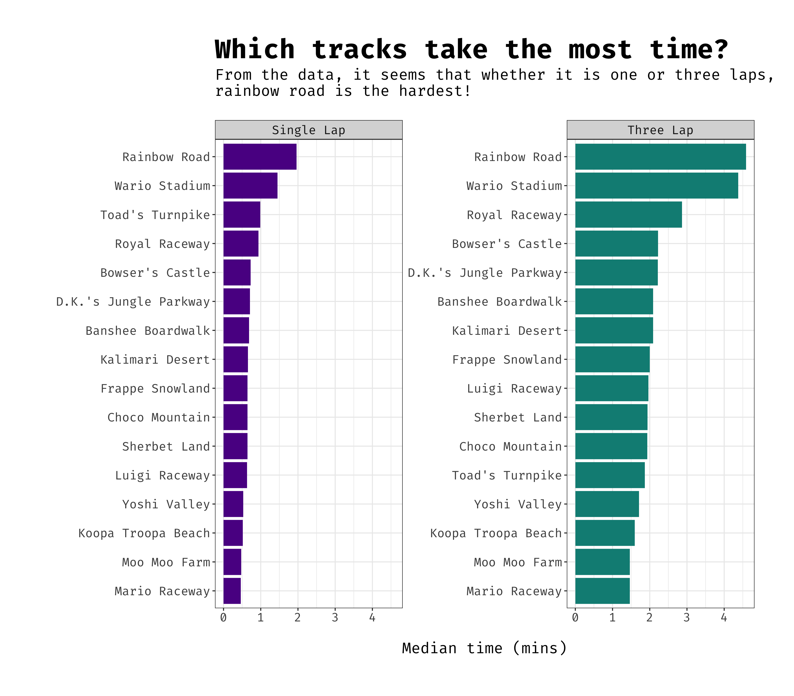

# Tidy Tuesday : Mario Kart
## 25-05-2021


Data comes from [github.com/rfordatascience/tidytuesday](https://github.com/rfordatascience/tidytuesday/blob/master/data/2021/2021-05-25/readme.md)


I didn't have much time, but was interested to see if everyone else found Rainbow Road as hard as I did!





Data seems to confirm... yes they did. 


R Code:

```
# load in the libraries
library(tidyverse)
library(tidytext)

# create my theme options
my_theme <- theme_bw() + 
  theme(text = element_text(family="Fira Code", size = 16), 
        plot.title = element_text(size = 28, face = "bold")) + 
  theme(legend.position = "none") + 
  theme(plot.margin=unit(c(1.5,1.5,1.5,1.5),"cm"))

# load in the data 
records <- readr::read_csv('https://raw.githubusercontent.com/rfordatascience/tidytuesday/master/data/2021/2021-05-25/records.csv')

# have a look at the data 
glimpse(records)

# test which tracks take the longest (type of lap maybe has an effect)
records %>% 
  group_by(track, type) %>% 
  summarise(median_times = median(time, na.rm = TRUE)/60) %>%
  ungroup() %>%
  mutate(type = as.factor(type),
         track = reorder_within(track, median_times, type)) %>%
  ggplot(aes(x = track, y = median_times, fill = type)) +
  geom_col(show.legend = FALSE) +
  facet_wrap(~ type, scales="free_y") +
  coord_flip() +
  scale_x_reordered() + 
  scale_fill_manual(values = c("#5B0893","#078C84")) + 
  labs(title = "Which tracks take the most time?\n", 
       y = "\nMedian time (mins)", 
       x = " ") + 
  my_theme

# save the plot
ggsave("final_plots/mario_kart_tracks.png")


```